ifndef::imagesdir[:imagesdir: imgs]
:help-url: {papyrusweb-url}doc/index.html
ifndef::imagesdir[:imagesdir: imgs]

## Papyrus Software Designer in the Deeplab project 

Papyrus Software designer is an extension of the UML Papyrus Editor. This text is an overview focusing in the existing capabilities. The complete documentation is available at: (https://wiki.eclipse.org/Papyrus_Software_Designer) 

### Direct code generation

Generates code from UML class diagrams. Used when the semantics of the model is close to a target programming language. For instance, UML classes are directly transformed into Java classes.
Currently supports C/C++, Java and Python.

#### Version support: 

**Source**: UML class diagram, all elements

**Targets**: the target version contains the base elements produced by the code generator. Additional constructs may be supported if written inside an OpaqueBehavior and that is compiled by the used version.
- C/C++ 14
- Java 11
- Python 3

### Support for component-based models

The code generation is done by a sequence of steps, because the source diagrams do not have a direct correspondence in a target programming language.

**Source**: composite diagrams, state machines and sequence diagrams. 
**Target**: C++ and Java

Each set of components are introduced later.

## Direct code generation

The code generators are Eclipse plug-ins that enable producing code in a given target language. The code generation task is has dedicated properties that are defined in a *common code generation profile*. Each language particularities that are not covered by this common profile are specialized in their own dedicated profiles.

### Common code generation

The code generation profile is available in the following link: https://git.eclipse.org/c/papyrus/org.eclipse.papyrus-designer.git/tree/plugins/languages/common/org.eclipse.papyrus.designer.languages.common.profile/profiles/Codegen.profile.uml

One major point is how UML associations are translated, which requires to the multiplicity of the target reference. The default configuration is:

- [n]: fixed with n elements;
- [0..n]: a set with 0-n elements. mapped to an array of elements;
- [m..n]: a set with minimum n and up to m elements 
- [0..*]: an unbounded list
    
The stereotype *ListHint* enables the specialization of the default configuration:
- [n]: fixed with n elements 
- [0..n], [m..n]: bound with max. n elements 
- [0..*]: variable / an unbounded list

The common code generation profile is shown below. The comments describe the elements semantics:

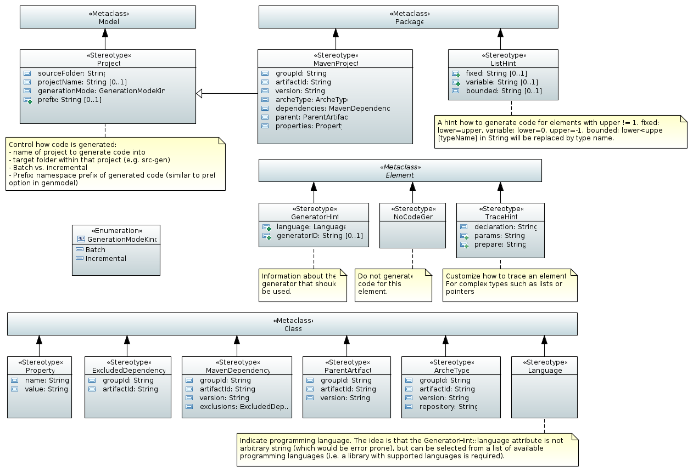 

image:/common/Templates_Tweaks.PNG[]

The full profile is available in the following link:
https://git.eclipse.org/c/papyrus/org.eclipse.papyrus-designer.git/tree/plugins/languages/common/org.eclipse.papyrus.designer.languages.common.profile/profiles/Codegen.profile.uml 

### Java code generation

The documentation of the Eclipse implementation and installation is available in the following link: https://wiki.eclipse.org/Java_Code_Generation. The description below is an overview of the generator features.

Code is generated for the full model, a specific classifier or package.

Creates a JDT project and corresponding code. Referenced (or child) classifiers are also generated.

The profile with Java specific settings is available in this link: https://git.eclipse.org/c/papyrus/org.eclipse.papyrus-designer.git/tree/plugins/languages/java/org.eclipse.papyrus.designer.languages.java.profile/profiles/PapyrusJava.ecore 

The two diagrams below contain the profile definition:

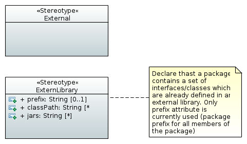

image:./java/Java_Modifiers.PNG[]

### C/C++ code generator

The documentation of the Eclipse implementation and installation is available in the following link: https://wiki.eclipse.org/Papyrus/Codegen/Cpp_description. The description below is an overview of the generator features. 

The C++ code generator focuses on structural elements, generating code for classes, datatypes (C++ structs or unions) and primitive and its relationships.

The behavior of operations are supplied as an opaque behavior, i.e. a text block that is stored inside the model. 

The code generator places the created files in a folder hierarchy that corresponds to the package hierarchy in the model. By default, the files are generated into a CDT project with the name org.eclipse.papyrus.cppgen.**name of your model**. 

The profile definition is available in this link: https://git.eclipse.org/c/papyrus/org.eclipse.papyrus-designer.git/tree/plugins/languages/cpp/org.eclipse.papyrus.designer.languages.cpp.profile/profiles/C_Cpp.profile.uml. 

C++ general configuration

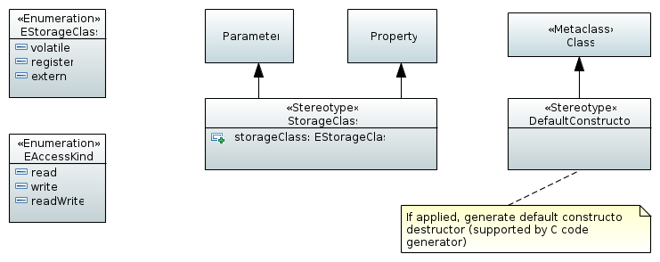

C++ enumerations

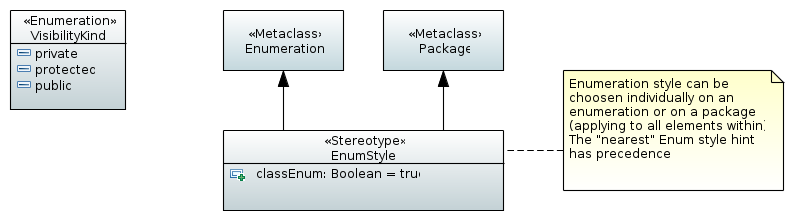

C++ modifiers

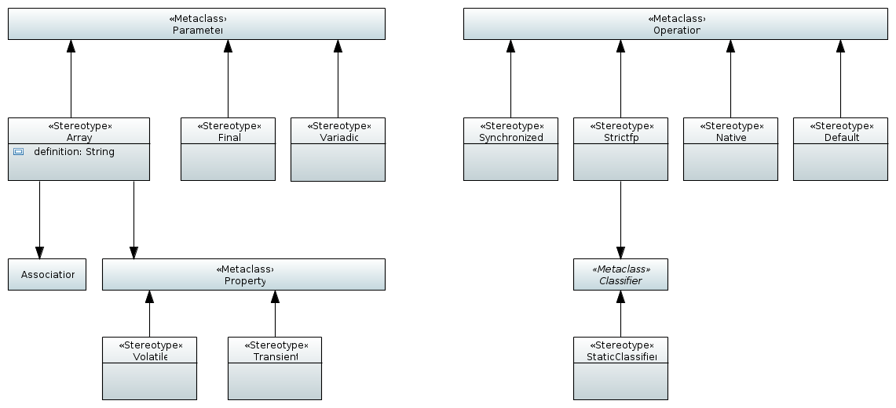

C++ templates

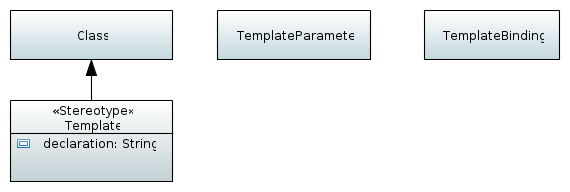

C++ Tweaks

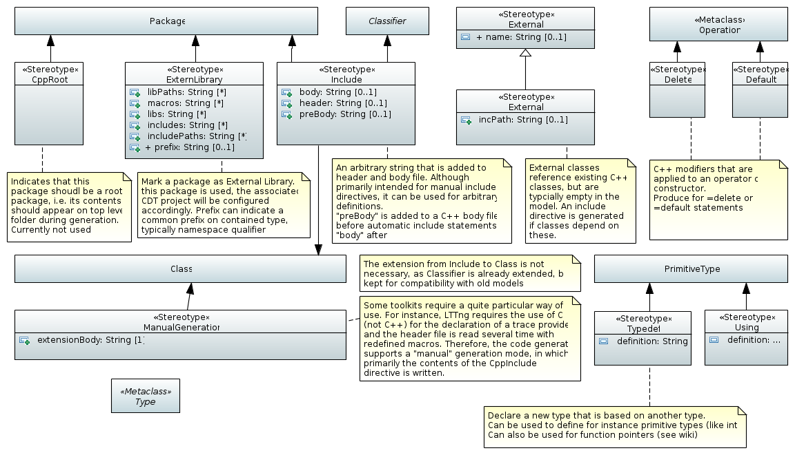

### Python code generator

The Python code generator profiles simple specializations which are defined in the Python profile.

The profile definition is available in this link: https://git.eclipse.org/c/papyrus/org.eclipse.papyrus-designer.git/tree/plugins/languages/python/org.eclipse.papyrus.designer.languages.python.profile/profiles/python.profile.uml

Python profile elements

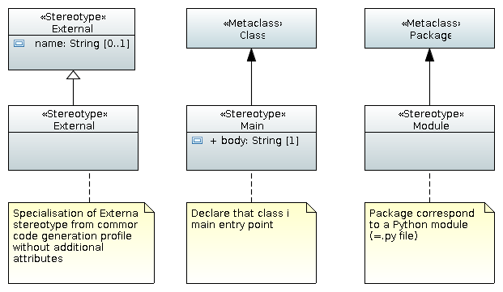

## Support for component-based models

The source diagrams do not have a direct correspondence in a target programming language. It is necessary to perform a set of refactoring actions to be able to generate the target code.

The refactorings are done by executing a sequence of model transformations, forming a transformation chain. Examples of transformation chains are available in the following link: https://wiki.eclipse.org/Papyrus/designer/transformations. The sequence of transformations produce a UML model containing class diagrams that are used as input to a direct code generation. 

We provide a short introduction of the supported diagrams. The customizations for each generation are done by (1) applying the *direct code generation* profiles or by (2) modifying the transformation chains. The latter requires modification in the implementation.

### State machine supports

State machines are supported for code generation, following the PSSM (Precise Semantics of State-machines) definition described by OMG. All the elements of state machines are supported for generating C++ code. In the case of Java, only single-region state-machines are supported.

**NOTE:** All the elements described **above** are supported by the integration of PapyrusWeb and the code generation service in the Deeplab framework. The elements described **below** have support only in the Papyrus Software Designer Desktop. The integration with Papyrus Web is subject for further testing.

### Component based model

Components are modelled using UML composite structure diagram, i.e. the possibility to describe a component with its ports and its internal structure. Ports enable transferring data or by the provided/required services. 

There is not a direct correspondence of ports of components in a OO world. 
Ports are required or provided interfaces (2 interfaces).

The complete profile of the supported component-based model is described in the following link: https://git.eclipse.org/c/papyrus/org.eclipse.papyrus-designer.git/tree/plugins/components/org.eclipse.papyrus.designer.components.fcm.profile/model

The diagrams below present  the input model stereotypes to be used.

Code generation options
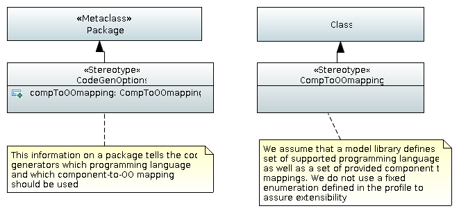

Components 
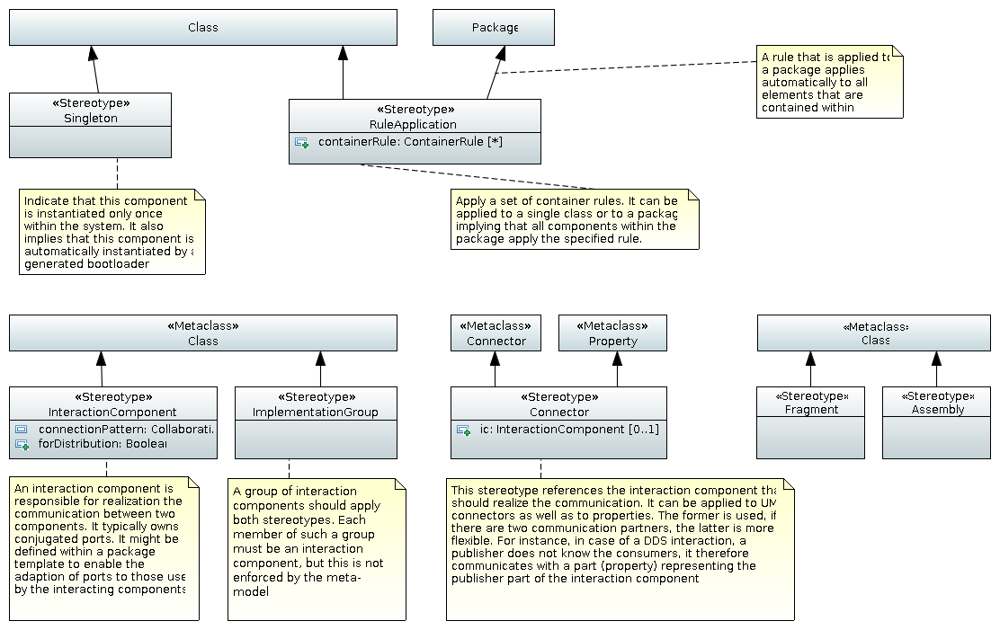

Components container
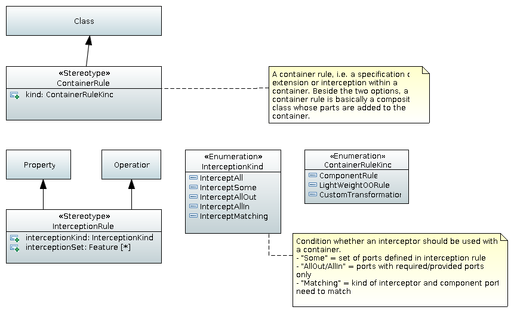

Components ports
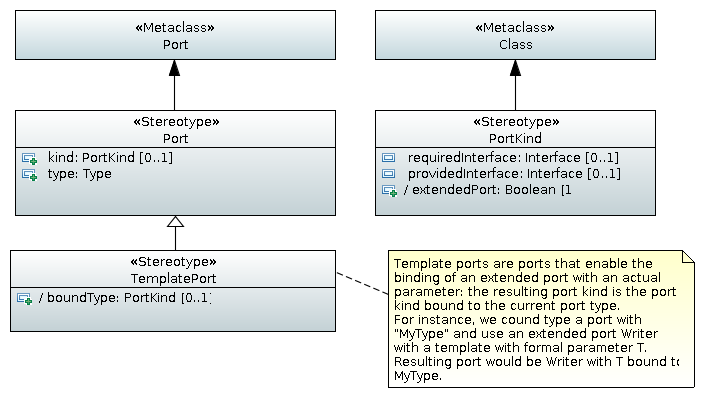

### Deployment model

The deployment of an application consists to define the component instance, their configuration and their allocation to an execution node. The UML composite structure defines the roles that are played by each component of the system. 

A Deployment model may be used as input for code generation, either in C++ or Java. 

The complete profile of the supported component-based model is described in the following link: https://git.eclipse.org/c/papyrus/org.eclipse.papyrus-designer.git/tree/plugins/deployment/org.eclipse.papyrus.designer.deployment.profile/model

The diagrams below present  the input model stereotypes to be used.

Deployment diagram configuration
image:./deployment/Deployment.PNG)

#### Customizations: Papyrus 4 Robotics

The components of Papyrus Software designer may be customized for specific code generation tasks. The **Papyrus4Robotics** tool is one customization for defining generating robotics code. Details of the implementation are available in the following link: https://wiki.eclipse.org/Papyrus/customizations/robotics. The integration within the Deeplab architecture is subject of future work.

